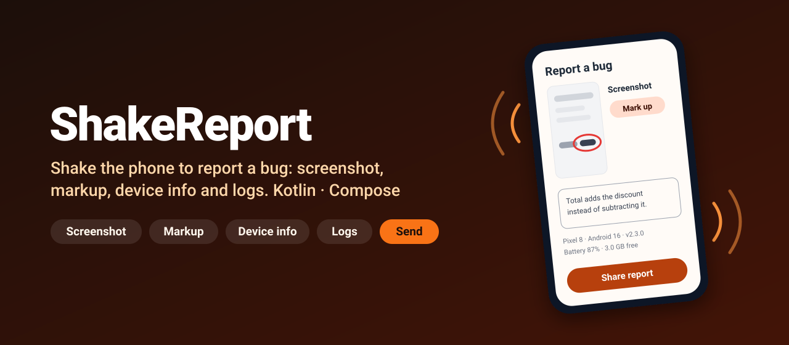
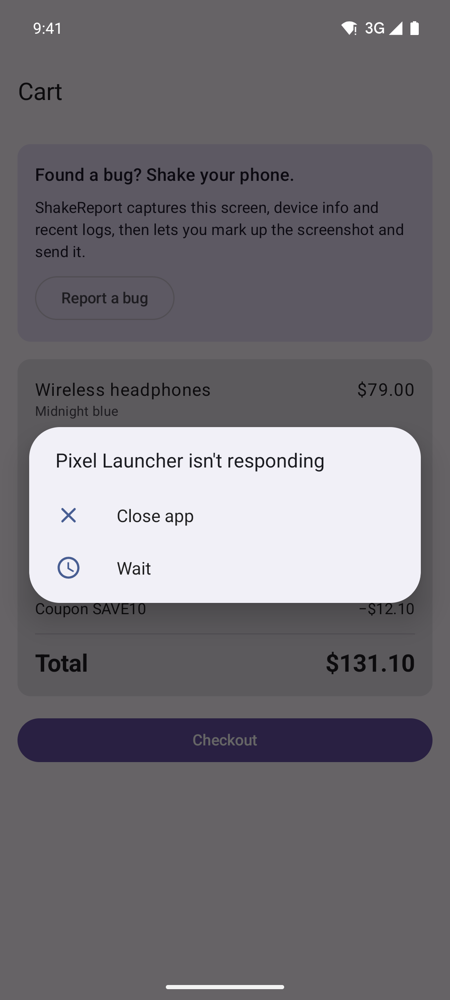
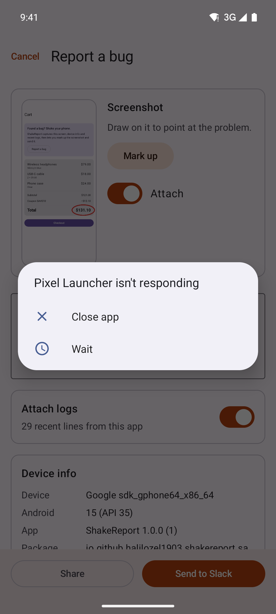
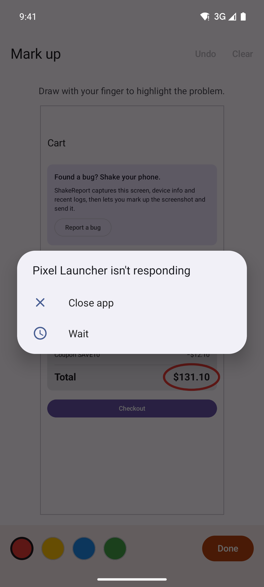
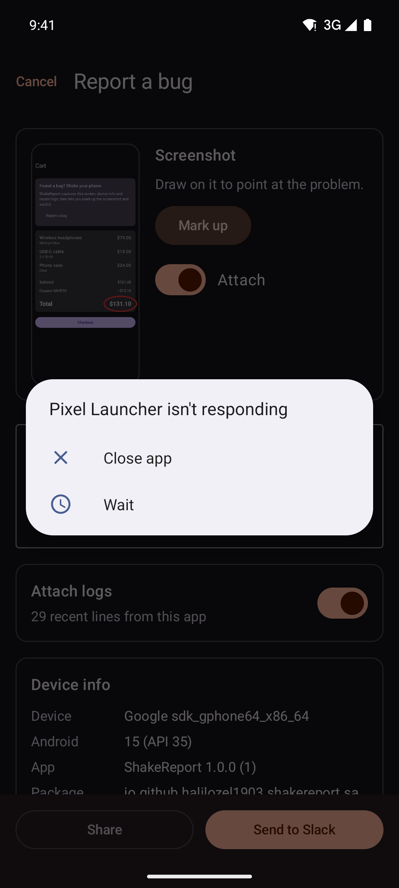

<p align="center">
  
</p>

<p align="center">
  <a href="https://github.com/halilozel1903/ShakeReport/actions/workflows/ci.yml"></a>
  <a href="https://jitpack.io/#halilozel1903/ShakeReport"></a>
  
  
  
  <a href="LICENSE"></a>
</p>

**ShakeReport** turns every internal and beta build into a bug reporting tool. Testers shake the phone; ShakeReport captures the screen, device and app details and the app's recent log lines, and opens a report screen where they circle the problem, describe it and send it through the share sheet or straight to Slack, Jira or your backend.

```kotlin
class App : Application() {
    override fun onCreate() {
        super.onCreate()
        if (BuildConfig.DEBUG) ShakeReport.install(this)
    }
}
```

## Screenshots

Captured from the sample app on an Android emulator by CI.

| The app | Report screen | Mark up | Dark mode |
| :---: | :---: | :---: | :---: |
|  |  |  |  |

## Why

"It's broken on the checkout screen" is not a bug report. Testers rarely add the device, the app version or the steps, and never the logs. ShakeReport collects all of it the moment they notice something, with one gesture and without leaving the app, and it only takes one line to add to a debug or beta build.

## Features

- 📳 **Shake detection** from the accelerometer with a configurable force, number of shakes, time window and cooldown. The detector is pure Kotlin and unit tested.
- 🔋 **Foreground only**: `install()` tracks the resumed activity with `ActivityLifecycleCallbacks` and listens to the sensor only while the app is visible.
- 📸 **Screenshot** of the current window with `PixelCopy` on API 26+ (Compose, maps and video included), `View.draw` on older versions.
- ✏️ **Markup**: draw on the screenshot with a pen in four colors, with undo and clear. The strokes are burned into the exported PNG.
- 📱 **Device and app info**: model, Android version, app version, locale, screen, battery, memory, app heap, plus your own custom data.
- 🪵 **Recent logs**: the app's own last logcat lines (no permission needed); testers can leave them out per report.
- 📤 **Share sheet** with the screenshot and a `report.txt` attached through a bundled `FileProvider`, pre-filled subject, text and recipients.
- 🔌 **Custom `ReportSender`** for Slack, Jira, Linear or your backend, shown as a second button next to "Share".
- 🎨 **Material 3 report screen** in Jetpack Compose, light and dark, edge to edge.
- 🧪 **Pure Kotlin core** (`shakereport-core`): shake detector, device info model and report formatter, tested without an emulator.

## Installation

Add JitPack to `settings.gradle.kts`:

```kotlin
dependencyResolutionManagement {
    repositories {
        google()
        mavenCentral()
        maven("https://jitpack.io")
    }
}
```

Then the dependency, ideally only for the builds testers use:

```kotlin
dependencies {
    debugImplementation("com.github.halilozel1903.ShakeReport:shakereport:1.0.0")
    // or for a "beta" build type / flavor:
    // "betaImplementation"("com.github.halilozel1903.ShakeReport:shakereport:1.0.0")
}
```

> The build is also set up for Maven Central (`io.github.halilozel1903:shakereport`) via the vanniktech publish plugin.

If you add it with `debugImplementation`, call `install()` from a class in `src/debug` so release builds don't reference it.

## Quick start

```kotlin
ShakeReport.install(
    application = this,
    config = ShakeReportConfig(
        shake = ShakeConfig.Default,                 // or Sensitive / Firm / ShakeConfig(...)
        emailRecipients = listOf("qa@example.com"),  // pre-filled when shared to an e-mail app
        subjectPrefix = "[Beta]",
        customData = { mapOf("User" to session.userId, "Flavor" to BuildConfig.FLAVOR) },
    ),
)
```

That's it. Shake the phone in any screen of the app to open the report.

Open it from code too, for example from a debug menu or on an emulator:

```kotlin
ShakeReport.show(activity)
ShakeReport.show(activity, description = "Checkout looks off", openMarkup = true)
```

Pause shake detection where shaking is part of the experience:

```kotlin
ShakeReport.isShakeEnabled = false   // e.g. in a game level
```

## Shake settings

| | `Sensitive` | `Default` | `Firm` |
| --- | --- | --- | --- |
| Force (`thresholdG`) | 2.0 g | 2.7 g | 3.3 g |
| Shakes (`shakeCount`) | 2 | 2 | 3 |
| Window (`windowMillis`) | 1000 ms | 1000 ms | 1500 ms |
| Cooldown (`cooldownMillis`) | 2000 ms | 2000 ms | 2000 ms |

A phone lying still reads 1 g. Samples closer together than `minPeakGapMillis` (100 ms) belong to the same jolt and count once.

On the emulator, open **Extended controls > Virtual sensors > Device pose** and move the phone quickly, or use `ShakeConfig.Sensitive`.

## Sending to Slack, Jira or your backend

Implement `ReportSender`. It runs on `Dispatchers.IO`; throw to show an error and keep the report open.

```kotlin
class SlackWebhookSender(private val webhookUrl: String) : ReportSender {
    override val label = "Send to Slack"

    override suspend fun send(context: Context, payload: ReportPayload) {
        val body = JSONObject().put("text", payload.summary).toString()
        val connection = URL(webhookUrl).openConnection() as HttpURLConnection
        try {
            connection.requestMethod = "POST"
            connection.doOutput = true
            connection.setRequestProperty("Content-Type", "application/json")
            connection.outputStream.use { it.write(body.toByteArray()) }
            check(connection.responseCode in 200..299) { "Slack returned ${connection.responseCode}" }
        } finally {
            connection.disconnect()
        }
        // Upload payload.screenshotFile and payload.reportFile with Slack's files API if you need them.
    }
}

ShakeReport.install(this, ShakeReportConfig(sender = SlackWebhookSender(BuildConfig.SLACK_WEBHOOK)))
```

`ReportPayload` gives you everything:

| Property | What it is |
| --- | --- |
| `report` | The structured `BugReport`: description, `DeviceInfo`, logs, custom data |
| `subject` | `[Bug] Shop 2.3.0 – Total is wrong after applying a coupon` |
| `summary` | The report as text, without log lines (good for chat) |
| `text` | The full report as text, with logs when the tester kept them |
| `screenshotFile` | The marked-up screenshot as PNG, or `null` |
| `reportFile` | `text` as a `report.txt` file |

## What a report looks like

```text
[Beta] Shop 2.3.0 – Total adds the discount instead of subtracting it

Description
-----------
Total adds the discount instead of subtracting it.

Device
------
Device:    Google Pixel 8
Android:   16 (API 36)
App:       Shop 2.3.0 (230)
Package:   com.example.shop
Locale:    en-US
Screen:    1080 × 2400 px, 420 dpi
Battery:   87%, charging
Memory:    3.0 GB free of 8.0 GB
App heap:  24.0 MB of 256.0 MB
Reported:  2026-09-27 10:15:30 UTC

Custom data
-----------
User:    demo-user-42

Attachments
-----------
Screenshot: attached

Logs (last 300 lines)
---------------------
09-27 10:15:21.113  4242  4242 W PriceCalculator: Discount applied with a positive sign: +12.10
…
```

## Good to know

- **For internal builds.** Screenshots and logs can contain personal data. Ship ShakeReport in debug or beta builds, not to production users.
- **Only the app's own window** is captured. Dialogs, popups and the keyboard live in other windows; `SurfaceView` content needs API 26+ (PixelCopy). Pass your own bitmap with `ShakeReport.show(activity, screenshot = bitmap)` if needed.
- **Logs** come from `logcat --pid` of the app process. Apps can't read other apps' logs, and some OEM builds limit logcat for apps entirely.
- **Files** are written to `cacheDir/shakereport/` and shared through `<applicationId>.shakereport.fileprovider`, which never clashes with your own `FileProvider`. Only the latest report is kept.
- **Process death** while the report screen is open closes it, because the screenshot lives in memory.

## Testing your own logic

`shakereport-core` is plain Kotlin, so shake settings and formatting can be tested on the JVM:

```kotlin
val detector = ShakeDetector(ShakeConfig(thresholdG = 2.5f, shakeCount = 2))
val g = ShakeDetector.STANDARD_GRAVITY
assertFalse(detector.onAcceleration(3 * g, 0f, 0f, timestampMillis = 0))
assertTrue(detector.onAcceleration(3 * g, 0f, 0f, timestampMillis = 400))

val text = ReportFormatter(subjectPrefix = "[Beta]").format(report, includeLogs = false)
```

## Project structure

| Module | What it is |
| --- | --- |
| `shakereport-core` | Pure Kotlin: shake detector, `DeviceInfo`, `BugReport` and `ReportFormatter` |
| `shakereport` | Android: auto-install, sensor, screenshot, device info and logcat collection, Compose report screen, share sheet |
| `sample` | A small shop app with a wrong total to report |

## Tech stack

Kotlin 2.4 · AGP 9.4 with built-in Kotlin · Gradle 9.6 · Jetpack Compose (BOM 2026.09) · Material 3 · Coroutines · PixelCopy · FileProvider · GitHub Actions

## License

MIT. See [LICENSE](LICENSE).
